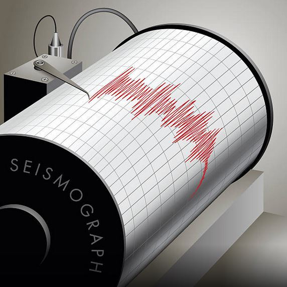

-   [earthquakesWithR](#earthquakeswithr)
    -   [Installation](#installation)
    -   [Data](#data)
    -   [Example - Timeline](#example---timeline)
    -   [Example - Leaflet Map](#example---leaflet-map)

<!-- README.md is generated from README.Rmd. Please edit that file -->


earthquakesWithR
================

[](https://travis-ci.org/moralmar/earthquakesWithR) [](http://cran.r-project.org/package=earthquakesWithR) [](https://badge.fury.io/gh/moralmar%2FearthquakesWithR)

The goal of `earthquakesWithR` is to give a few handy visualization tools for the NOAA data set. It provides to the user of this package the following functions:
- **geom\_timeline()** - which is a specific geom for the `ggplot2` package
- **geom\_timeline\_label()** - which is an extension for the above geom
- **eq\_location\_clean()** - which is a helper function, cleaning the NOAA dataset
- **eq\_clean\_data()** - a function which loads and applies a few cleaning function to it
- **eq\_map()** - a function creating a `leaflet` map and visualizing the earth quakes
- **eq\_create\_label()** - is a helper function, creating a nice pop-ups in the leaflet map

Installation
------------

align="right" / You can install `earthquakesWithR` from github with:

``` r
# install.packages("devtools")
devtools::install_github("moralmar/earthquakesWithR")
```

Data
----

The Significant Earthquake Database contains information on destructive earthquakes from 2150 B.C. to the present that meet at least one of the following criteria: Moderate damage (approximately $1 million or more), 10 or more deaths, Magnitude 7.5 or greater, Modified Mercalli Intensity X or greater, or the earthquake generated a tsunami.
Feel free to browse through the code as follows:

``` r
# To load the earth quake data and have a look:
data("NOAAearthquakes")

# the following is a spatial polygon data frame, which merely gives a nice touch to the leaflet map
# hence, there is not much to see here
data("world")
```

Example - Timeline
------------------

Here are three simple examples, showing
- a single country without labels
- a single country with labels
- and showing multiple countries, also with lables

``` r
require(earthquakesWithR)
require(magrittr) # for piping operator
require(dplyr) # for filter/subsetting functions
require(ggplot2) # should be obvious :)
require(ggthemes) # for the theme_classic()
```

``` r
# Load the data and filter it accordingly to your needs
quakes <- eq_clean_data()
quakes_filtered <- quakes %>%
        filter(COUNTRY %in% c("USA") & YEAR >= 1000)

# single country without labels
ggplot() +
        geom_timeline(data = quakes_filtered, aes(x = date, y = COUNTRY, color = TOTAL_DEATHS, size = EQ_PRIMARY)) +
        theme_classic()
```


``` r
# Load the data and filter it accordingly to your needs
quakes <- eq_clean_data()
quakes_filtered <- quakes %>%
        filter(COUNTRY %in% c("PERU") & YEAR >= 1960)

# single country without labels
ggplot() +
        geom_timeline(data = quakes_filtered, aes(x = date, y = COUNTRY, color = TOTAL_DEATHS, size = EQ_PRIMARY)) +
        geom_timeline_label(data = quakes_filtered, aes(x = date,
                                                 y = COUNTRY,
                                                 magnitude = EQ_PRIMARY,
                                                 label = LOCATION_NAME,
                                                 n_max = 6)) +
        theme_classic()
```


``` r
# Load the data and filter it accordingly to your needs
quakes <- eq_clean_data()
quakes_filtered <- quakes %>%
        filter(COUNTRY %in% c("ECUADOR", "PERU", "CHILE") & YEAR >= 1000)

# single country without labels
ggplot() +
        geom_timeline(data = quakes_filtered, aes(x = date, y = COUNTRY, color = TOTAL_DEATHS, size = EQ_PRIMARY)) +
        geom_timeline_label(data = quakes_filtered, aes(x = date,
                                                 y = COUNTRY,
                                                 magnitude = EQ_PRIMARY,
                                                 label = LOCATION_NAME,
                                                 n_max = 4)) +
        theme_classic()
```


Example - Leaflet Map
---------------------

Besides the added timeline geom-functions, the package provides a few function which helps to easily create a `leaflet map`. What these functions do is shown below. Keep in mind that this is static maps, respectively a print screen of the leaflet map (because the README.rm is a static file format). It shows the two main functions in action:

-   **eq\_map()** - the base function creating a `leaflet` map and visualizing the earth quakes
-   **eq\_create\_label()** - is a helper function, creating a nice pop-ups in the leaflet map

``` r
# in addition to the earthquakesWithR package, we need:
require(leaflet)

eq_clean_data() %>%
        dplyr::filter(COUNTRY == "MEXICO" & lubridate::year(date) >= 2000) %>%
        dplyr::mutate(popup_text = eq_create_label(.)) %>%
        eq_map(annot_col = "popup_text")
```


